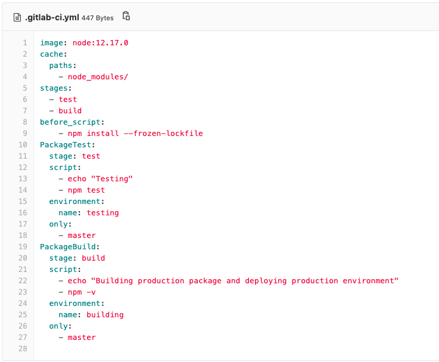

# Add Records in local storage in React Native with Continuous Integration in Gitlab

### Features!

  - Add multiple user records ( Name, Country, Phone Brand and Phone Number)
  - Store the records locally and list the records
  - Search the records on the basis of country or phone brand
  - Integrated CI ( Continuous Integration ) using Gitlab

### Installation

The app was developed with [Node.js](https://nodejs.org/) v12+ .

Clone the repo and run the server

```sh
git clone https://gitlab.com/dileepthakur87/add-records-rn.git
cd add-records-rn
npm install
npm start
```

After this you can scan the qr to run the app on you phone. Make sure you have installed expo client on your phone.


### Continuous Integration with Gitlab

- Add your public key to gitlab. If you haven't one, you can generate public key using following command.
```sh
ssh-keygen -t rsa -b 4096 -C "your_email_here"
```

- Add the [.gitlab-ci.yml](https://gitlab.com/dileepthakur87/add-records-rn/-/blob/master/.gitlab-ci.yml) file in the root directory of your app. 



-- NOTE: There are two stages included here where test stage is to run the test under CI whereas the another stage build, here is to just show how we can work with multiple stages in the pipeline. For sample purpose, in the build stage, i am running ``` npm -v ```. This is actually for the deployment/build so commands used to build/deploy the project are to be added in the build stage.
```sh
image: node:12.17.0  # node image of version 12.17.0
cache: # caching the node_modules in the container
  paths:
    - node_modules/
stages:
  - test
  - build
before_script: # installing the changes from the package lock file.
    - npm install --frozen-lockfile
PackageTest: # test stage 
  stage: test
  script:
    - echo "Testing"
    - npm test # runs the test using jest in this project
  environment:
    name: testing
  only:
    - master # branch
PackageBuild:
  stage: build
  script:
    - echo "Building production package and deploying production environment"
    - npm -v # sample script in build stage so as to show how we can work with multiple stages
  environment:
    name: building
  only:
    - master # branch
```

- Verify your yml file using **CI Lint** in Gitlab. You can find it from the **CI/CD** section. ( specially from the pipeline section on the top right corner or if the pipeline is not initiated before, it's even present in the jobs section on the top right corner) 
- Push you code and under **Pipeline**, you can see your pipeline running. Tapping on the process, you can view the details/logs of each step included in the [.gitlab-ci.yml](https://gitlab.com/dileepthakur87/add-records-rn/-/blob/master/.gitlab-ci.yml) file.

### Todos

 - Write MORE Tests
 - Integrate CD

License
----

**Free Software, Hell Yeah!**